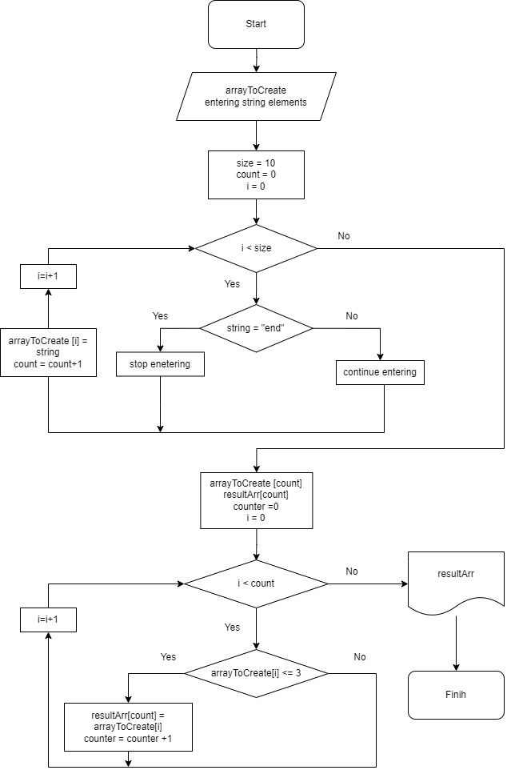

# 
Final_TEST
 

## 
Контрольная работа
 
**Задача:** Написать программу, которая из имеющегося массива строк формирует новый массив из 
строк, длина которых меньше, либо равна 3 символам. 
Первоначальный массив можно ввести с клавиатуры, 
либо задать на старте выполнения алгоритма. 
При решении не рекомендуется пользоваться коллекциями, лучше обойтись исключительно массивами.

Примеры:

[“Hello”, “2”, “world”, “:-)”] → [“2”, “:-)”]

[“1234”, “1567”, “-2”, “computer science”] → [“-2”]

[“Russia”, “Denmark”, “Kazan”] → []

____

## 
Решение

### Для решения задачи были созданы методы:
* CreateArray - для заполнения массива
* ChangeArray - для посчета элементов меньше или равных 3 символам, заполнения нового массива, исходя из нового размера;
* PrintArray -  для вывода массива;

### Алгоритм решения:
+ Выводим запрос на ввод элементов массива;
+ Пользователь заполняет массив с клавиатуры нажимая Enter для продолжения ввода или пишет слова end для остановки;
+ После ввода строки, разделяем данные на отдельные элементы (Split (' '))  и записываем их в массив (arrayToCreate);
+ Вводим новый массив (resultArr), размер которого пока приравниваем к размеру arrayToCreate.
+ Вводим переменную count (счетчик элементов, удовлетворяющих условию <= 3).
+ Выполняем проверку каждого элемента массива arrayToCreate на количество символов (<= 3), нужные элементы записываем в новый массив resultArr и меняем счетчик. 
+ Меняем размер полученного массива, исходя из данных счетчика(count);
+ Выводим на экран первоначальный массив arrayToCreate и далее требуемый условием массив resultArr;
____

**Графическое представление решения:** 

